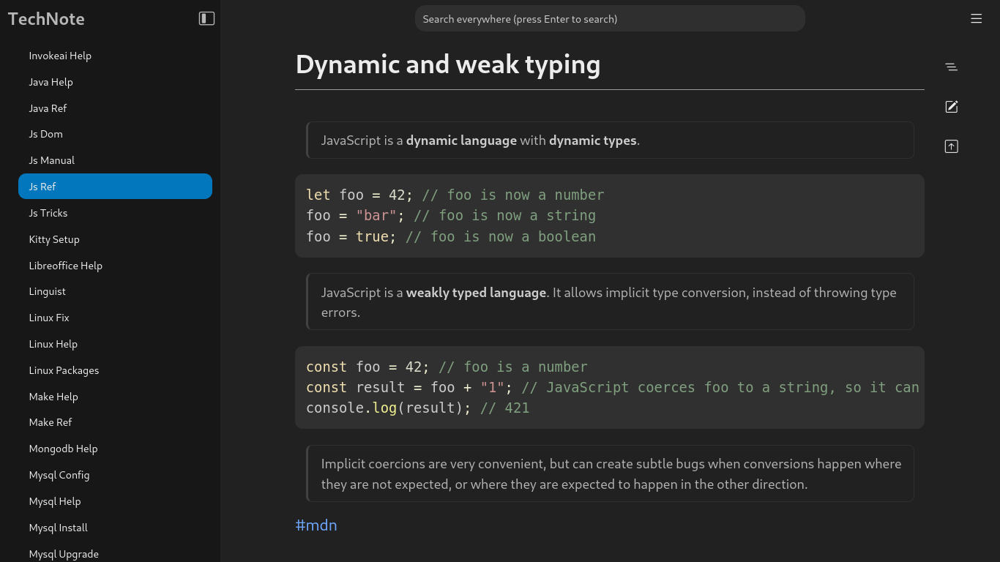

# TechNote

**TechNote** — your Markdown notes, beautifully organized.

TechNote is a self-hosted, distraction-free Markdown-based note-taking app built with Flask and React. Lightweight, fast, and customizable — designed for developers who prefer to keep their notes in plain text and under their control.



### Features

- 📂 **Local Files, Your Way** — _Open any folder of Markdown (`.md`) notes directly, no import or sync required._
- 🛡️ **Own Your Notes** — _Files are standard Markdown, stored locally — no vendor lock-in, no surprises._
- 🧭 **Effortless Navigation** — _Browse folders, jump between notes, and navigate through headings with ease._
- 🔍 **Fast Full-Text Search** — _Quickly search across all your notes._
- 🖥️ **Responsive Interface** — _Clean, distraction-free design that works beautifully on desktop and mobile._

## 🚀 Get Started

### Installation

```bash
git clone https://github.com/miladnia/technote.git
cd technote
make install
```

> **Requirements:** Python `>= 3.10`, Node `>= 18.20`, and pipx.

### Run the server

Start the TechNote server:

```bash
technote
```

By default, the server runs on `http://localhost:8087`.  
Customize with:

```bash
technote --host=0.0.0.0 --port=PORT
```

> [!TIP]
> To prevent the browser from opening automatically, add the `--no-browser` flag.


## 🖥️ Usage Tips

Use the **Open Directory** button in the sidebar to open a directory containing your Markdown (`.md`) files. If you don't have one yet, you can create an empty directory (e.g., `~/Documents/notes/tech_notes`) and open it. Once opened, you’ll see an option next to the directory name to create new notes.

> [!TIP]
> No Markdown notes yet? Click **"Try with example notes"** after launching!


## ✨ How It Works

- **Rendering:** TechNote aims to keep everything explicit and transparent. It simply renders your existing Markdown files as HTML documents. No hidden metadata. No extra files. No surprises. You have full control over your content.
- **Caches:** To improve performance, notes are cached as HTML and updated automatically when you edit them.
- **The database:** TechNote uses a lightweight SQLite database to store minimal metadata — such as unique IDs and display names for notes — and the paths to selected directories. Deleting the database will **not** affect your notes.


## 🛠 Built With

- [**Flask**][flask] — Powers the back end with a lightweight and flexible Python framework.
- [**Gunicorn**][gunicorn] — Serves the app efficiently in production environments.
- [**SQLite**][sqlite] — Stores meta data about notes and directories in a single lightweight file.
- [**Pandoc**][pandoc] — Converts Markdown into beautiful, structured HTML.
- [**Pypandoc**][pypandoc] — A Python wrapper around Pandoc for seamless integration.
- [**React**][react] — Enhances the web interface with dynamic, interactive components.
- [**Bootstrap**][bootstrap] — Provides a clean, responsive foundation for the UI.


## 💡 Creators

Milad Abdollahnia

- <https://github.com/miladnia>
- <https://twitter.com/xmiladnia>


## ⚖️ License

TechNote is an open-source software licensed under the [MIT License][mit].  
See the [LICENSE](./LICENSE) file for details.


[mit]: https://opensource.org/licenses/MIT
[flask]: https://github.com/pallets/flask
[gunicorn]: https://github.com/benoitc/gunicorn
[react]: https://github.com/facebook/react
[pandoc]: https://github.com/jgm/pandoc
[pypandoc]: https://github.com/JessicaTegner/pypandoc
[pandoc_install]: https://pypi.org/project/pypandoc/#Installing-pandoc
[sqlite]: https://github.com/sqlite/sqlite
[bootstrap]: https://github.com/twbs/bootstrap/
[make]: https://www.gnu.org/software/make/
